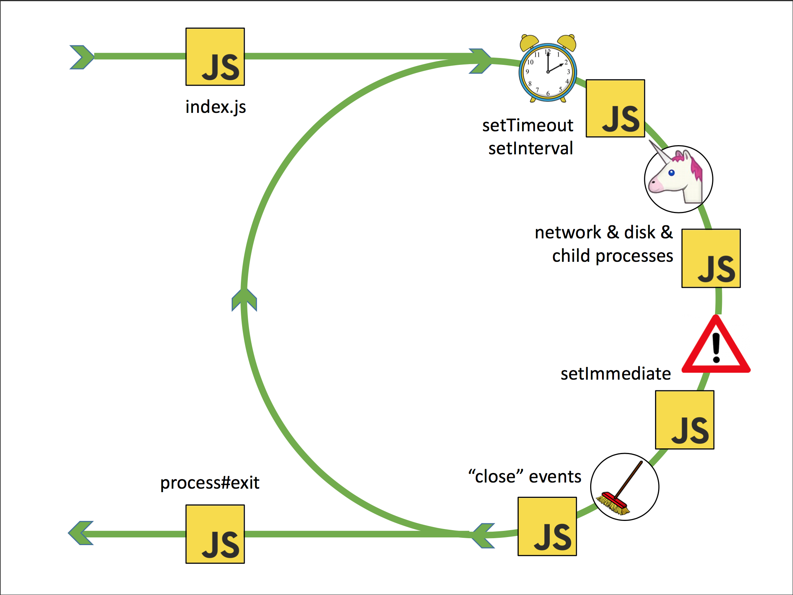
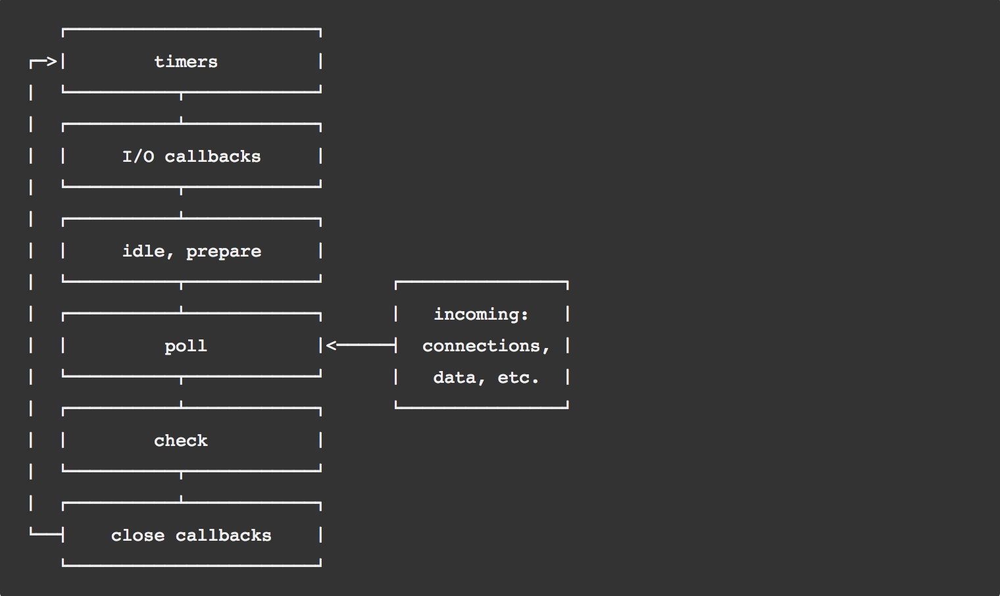

# Asynchronous programming in JavaScript and the event loop

## Topics

+ Abstract event loop
+ Programming techniques
+ Problems in testing
+ Node.js event loop

### Abstract event loop

+ Handles concurrency for JavaScript. It's more like a strategy but some people call the browser thread which manages a tab "The event loop"

> **Terms to understand:**
> 
> - Concurrency
> - Single threaded
> - Multi threaded

+ The behaviour of the event loop is similar in the browser and in Node.js
+ In the browsers does couple of things like:
1. Parsing HTML
2. Executing JavaScript code in script elements
3. Reacting to user input (mouse clicks, key presses, etc.)
4. Processing the result of an asynchronous network request


> **Terms to understand:**
>
> - [Blocking code](http://rauschma.github.io/async-examples/blocking.html)
    function sleep(milliseconds) {
		var start = Date.now();
	    while ((Date.now() - start) < milliseconds);
    }
> - I/O bound

**A possible implementation of the event loop**

```javascript
    while(queue.waitForMessage()) {
	    queue.processNextMessage()
    }
```

[**This helps to visualise the way it works**](http://latentflip.com/loupe/)

#### Example1:

```javascript
    function third(str) {
	    console.log(str);
	}
    function second(str) {
	    console.log(str);
	    third("third");
	}
    function first(str) {
	    console.log(str);
	    second("second");
	}
	first("first");
```
	
> **Terms to understand:**
>
> - Callstack
> - Run-to-completion (non breakable)

#### Example2

```javascript
    console.log("first");
    
    setTimeout(function timeoutCallback() {
	    console.log("second");
    }, 0);
    
    console.log("third");
```
 
> **Terms to understand:**
>
> - The world out there
> - APIs to the outer world (setTimeout, fs.readFile, DOM API)
> - Web API, C++ API
> - Asynchronous

#### Example3

```javascript
    $.on('button', 'click', function onClick() {
	    console.log('You clicked the button!');
    });
```

> **Summary**
> Asynchronous: I have no idea when it's going to happen.


----------


----------


----------


## Programming techniques

### Event-based

    var openRequest = indexedDB.open('test', 1);
    
    openRequest.onsuccess = function (event) {
        console.log('Success!');
        var db = event.target.result;
    };
    
    openRequest.onerror = function (error) {
        console.log(error);
    };

### Continuation-passing (CPS)

```javascript
    asyncOperation(arguments, function (err, result) {
	    // Do something
    });
```

> **Terms to understand**
> 
> - Node style callback -> conventions

```javascript
    function callback(err, result) {
	    if (err) {
		    return;
	    }
    }
    callback(new Error(), null);
    callback(null, result);
```

> **Terms to understand**
> 
> - Callback hell
> - Pyramid of Doom
> - Cowhead

```javascript
    asyncOp1(param1, function(err, value1) {
        asyncOp2(param2, function(err, value2) {
            asyncOp3(param3, function(err, value3) {	
            // Do something with value3
            });
        });
    });
```

### Promises

 - Promises are objects which represent the result of an asynchronous operation.
 - One async operation -> one promise
 - Helps to avert callback hell
 - Helps to control the flow
 
```javascript
    asyncOp1
        .then(asyncOp2)
        .then(asyncOp3)
        .then(function (value3) {
            // Do something with value3
        })
        .catch(function (error) {
            // Handle any error from all above steps
        });
```

### Generators

 - ES6 feature
 - Generators, are functions that can be paused and resumed.

```javascript
    function* idMaker() {

       let  index = 0;

       while(true) {
           yield index++;
       }
    }
    
```

```javascript
    const gen = idMaker();
    
    console.log("value": gen.next().value); // 0
    console.log(gen.next().value); // 1
```

### Async functions

```javascript
    async function asyncFunc(param1) {
  
        const result1 =  await firstAsyncFunc(param1);
    
        return await secondAsyncFunc(result1);
    }
```

----------


----------


----------

## Problems in testing

### Case1: mocking an asynchronous operation

```javascript
    // Async call
    DbClient.connect(connectString, function (err, db) {
	    // Do something with db
    })
    
    // Mocked async call
    sinon.stub(testNS, asyncMethod, (param, callback) => {
   
	    setImmediate(() => {
	    
		    callback(null, result);
	    });
    });
```

> **Note:**
> If you create a mock/stub for an async operation make that mock asynchronous. Like always...

### Case2: test something asynchronous

#### Code example

```javascript
    class AweSome {
    
	    start() {
	    
		    testNS.asyncMethod("foo/bar", (err, result) => {
		    
			    this.started = true;
		    });
	    }
    }
 ```
    
#### Test example

```javascript
    //  Anti-pattern alert - DO NOT DO IT
    describe("The \"started\" flag", () => {
    
	    describe("when the start method runs", () => {	
	    	
		    it("should get set to true", (done) => {
		    
			    awesome.start();
			    
			    process.nextTick(() => {
				    expect(awesome.started).to.be.true();
				    done();
			    });
		    });
	    });
    });
```

> **Things to remember**
> 
> - Return the promise when you test something promise based. Use done whe you test something callback based.
> - Make your assertion run after the asynchronous operation

### Case3 test for an event created by an async operation

#### Code example

```javascript
    class AweSome extends EventEmitter {
    
	    start() {
	    
	        testNS.asyncMethod("foo/bar", (err, result) => {
	            this.emit("started", true);
	        });
	    }
    }
```

#### Test example

```javascript
    describe("The \"started\" event", () => {
    
	    describe("when the start method runs", () => {
	        
	        it("should get emitted with true value", (done) => {

				function assertion(value) {
					expect(value).to.be.true;
					done();
				}

				awesome.on("started", assertion)
				awesome.start();
	        });
	    });
    });
```
    
----------


----------


----------
    
## Node.js Event Loop

+ Is Node.js single-threaded or multi-threaded?
+ The internet is wrong about the Node.js event loop.



+ "Initial" mode - The initial callstack
+ "Main" mode - When the event loop starts ticking
+ Exit
+ Phases



+ timers: Callbacks scheduled by setTimeout() and setInterval().
+ I/O callbacks: Callbacks with the exception of close callbacks, the ones scheduled by timers, and setImmediate().
+ idle, prepare: only used internally.
+ poll: retrieve new I/O events; Like new sockets for connections or data from file access. node will block here when appropriate. 
+ check: setImmediate() callbacks.
+ close: close callbacks: e.g. socket.on('close', ...). House keeping.
+ look at the source code: [libuv](https://github.com/libuv/libuv)

### process.nextTick

+ Run right after the particular callback is done running
+ Micro-task: process.nextTick and promise status handlers

### The poll phase - where the magic happens

+ Implementations are different for each runtime
+ linux: epoll
+ bsd: kqueue
+ windows: GetQueuedCompletionStatusEx

1. Puts the main thread in sleep
2. Blocks for IO for the timeout of the closest due timer. (What happens if there are no timers ???)
2. Starts polling for system events
3. Wakes up the main thread if either there is a direct event coming from the kernel or the thread pool is done with something or the next timer expires

### The thread pool

#### Directly pollables

+ sockets (net/dgram/http/tls/https)
+ timers (setTimeout, setInterval, setImmediate)
+ dns (except dns.lookup)
+ signals
+ child processes

#### Not directly pollables (pollables with thread and self pipe)

+ fs
+ dns.lookup
+ some crypto methods
+ http.get with domain names

#### thread pool size

+ default 4 workers
+ UV_THREADPOOL_SIZE environmental variable

### C++ Addons

+ Dangerous - you can do anything
+ You can access system services directly - blocking
+ You may overuse the thread pool

### Examples

+ In index.js

### What is Node.js for

+ Java servers - one thread per connection model. The limits of the op system
+ Node.js doesn't need threads. Very economic. Scales up spendidly
+ Node.js is for IO bound applications which need to scale up easily

### What is Node.js not for

+ Anything computational. Anything CPU bound...

### How to research the event loop

+ Avoid presentations like this
+ Look for resources created by the main contributors
+ Look at the code

### Main contributors

1. Bert Belder - @piscisaureus
2. Sam Roberts - @octetcloud
3. Saúl Ibarra Corretgé - @saghul
4. Ben Noordhuis - @bnoordhuis
5. Fedor Indutny - @indutny
6. Colin Ihrig - @cjihrig
7. Imran Iqbal - @iWuzHere
8. Santi Gimeno - @santigimeno

# Summary


